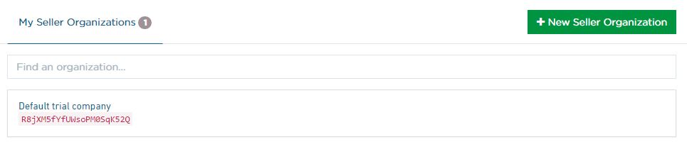
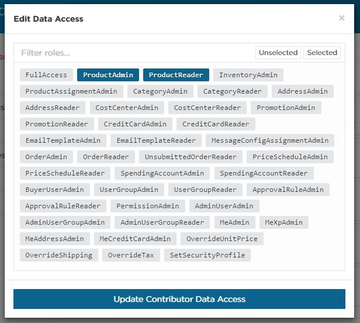
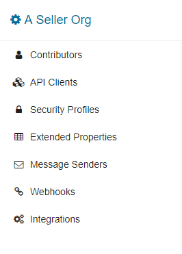

## Overview

The OrderCloud.io Dashboard is the central hub for managing your OrderCloud organizations and applications. This guide is meant to help you understand all the tools available to you and your team while creating and maintaining amazing B2B eCommerce solutions.

You will not be able to view the Dashboard if you haven't created an account. If you haven't already, <a ng-href="{{application.links.account + '/register'}}">register for OrderCloud.io</a> to access your free account.

## Getting to the Dashboard

Upon logging in for the first time you will be taken to your account profile page. Here you can edit your profile information and change your password.

Below your profile information you should see a _"My Seller Organizations"_ tab with a new seller organization called _"Default trial company"_.

Clicking on a seller in this list or creating a new organization will redirect you to what we call the **OrderCloud.io Dashboard**. Once you're in the dashboard you are now working within the context of a _single_ seller organization.

## Seller Organization Settings

This is the page you will land on when opening any organization. Use **Seller Options** and **Contributors** to modify the organizations settings.

### Seller Options

The organization owner has exclusive permission to change the seller options including updating the organization name, transferring the org to a contributing developer, or deleting the seller entirely. If you're a contributor, you can choose to leave the organization from this view.

### Contributors

Most B2B eCommerce projects require some level of collaboration. By sharing your organization with other team members on OrderCloud you can all work together on a single seller. Once a new contributor is added you can refine their access to your organization by adjusting their **permissions** & **data access**.

#### Contributor Permissions

Each permission controls whether or not a given contributor can access specific dashboard functionality for your seller organization. For example, you may have one contributor that is responsible for creating webhooks and integrations and another who is responsible for setting up security profiles for your end users.

#### Contributor Data Access

Data Access gives you control over which roles (if any) a given contributor can request when using the OrderCloud API with this seller organization or any of it's buyer organizations. A contributor with `FullAccess` here will have total control over any of the data under the seller organization. It is strongly recommended you use a combination of the granular roles that enable each developer to accomplish their project tasks to avoid unwanted or unexpected changes to your organization's data. OrderCloud roles are covered in-depth later in this guide.

## Dashboard Features

The left-hand menu is where you can access each of the dashboard features available to you for a given seller organization. Some features such as Message Senders or Integrations will be hidden from this menu if you do not have permission to access them.

Beyond these basic navigation items, there is a _"Switch Organization"_ button which allows you to quickly change your active seller organization, it located near the top right of the page.

## API Clients

An API Client is like an application or a pass that allows you to get an access token from Ordercloud. The API Client ID is given when authorizing into OrderCloud's API, and based off the API Client's configuration, OrderCloud knows which user types have access to your application and which access token it should return.

There are 3 types of Commerce Roles or distinct user types that exist in OrderCloud. There are _Sellers_, _Buyers_, and _Suppliers_. We want developers on Ordecloud to have flexiblity on how they make their applications, so they can configure and an API Client's with any number of Commerce Roles combinations.This feature allows for the ability to configure unique buyer and supplier networks, which can come in handy for SASS applications.

When creating a new Seller Organization, we create 2 API Clients for you, assuming that you'll have an application for your Seller users, and another application for your Buyer users. If this configuration is not to you and your team's liking, create a new API Client, or modify an existing one.

### API Client Settings

Opening an individual API Client will bring you to the **Settings** tab for that application. Seller Organization owners and contributors with permission to administer applications can update application information in this tab and activate/deactivate the application. Within this tab you’ll find the following:

<table class="table table-striped table-bordered"><colgroup><col width="25%"></colgroup> 
  <tbody>
    <tr>
      <th scope="row">Client ID</th>
      <td>The unique identifier of an application. This field is read-only and used in all OAuth2.0 workflows. It is a general rule that one front-end application be associated with a single Client ID or "application".</td>
    </tr>
    <tr>
      <th scope="row">Client Secret</th>
      <td>This is an optional elevated level of security. It allows you to require an additional keyphrase in all authentication requests. It is also used as part of the <a ui-sref="platform-guides({sectionID:'authentication',guideID:'oauth2-workflows', detailID:'ClientCredentialsGrantType'})">Client Credentials Grant Type workflow</a> for anonymous authentication or back office systems.</td>
    </tr>
    <tr>
      <th scope="row">Access Token Duration</th>
      <td>How long (in minutes) an access token will remain valid (max: 600m)</td>
    </tr>
    <tr>
      <th scope="row">Refresh Token Duration</th>
      <td>How long (in minutes) you are able to obtain a new Access Token (max: 43200m)</td>
    </tr>
  </tbody>
</table>

### Active User Access

The _"user access"_ tab is visible to owners and contributors with permission to administer API Clients. Within this tab you’ll find the following:

<table class="table table-striped table-bordered"><colgroup><col width="25%"></colgroup> 
  <tbody>
    <tr>
      <th scope="row">Client Access Configuration</th>
      <td>Set the Commerce Roles or the main user types that have access to the selected API Client. Editing the configuration is where you can specify indivual or networks of Buyer/Seller if needed.</td>
    </tr>
    <tr>
      <th scope="row">Client Default Context User</th>
      <td>
        If you're using the Client Credentials Grant Type OAuth2.0 workflow you will appear as the user selected.
        If a buyer user is selected, <a ui-sref="platform-guides({sectionID:'authentication',guideID:'anonymous-shopping'})">anonymous shopping and/or registration</a> can be enabled. Using the Client Credentials Grant Type OAuth2.0 workflow you can authenticate without a password and you will appear as a temporary user that has the same assignment based relationships and security as the anonymous template user.
      </td>
    </tr>
  </tbody>
</table>

### Active Webhooks

The _"webhooks"_ tab is visible to owners and contributors with permission to administer webhooks. This is where you will enable / disable webhooks for a given application. Create a webhook once using the [Webhooks](#Webhooks) feature and apply it to one or many applications using this workflow.

### Active Integrations

The application _"integrations"_ tab works a lot like the _"webhooks"_ tab. Only Seller Organization owners and contributors with permission to administer integrations will see it. By clicking _"add"_ you can choose from any of your configured [integration services](#Integrations) and apply it to said application.

## Security Profiles

This feature is available to organization owners and contributors with permission to administer security. Security Profiles are groupings of roles that can be later assigned to admin and buyer users using the <a ui-sref="api-reference({sectionID: 'AuthenticationAndAuthorization', resourceID:'SecurityProfiles'})">Security Profiles API</a>.

The granular nature of OrderCloud roles enables you to control exactly which API endpoints and/or data each user can access within your organization (similar to your contributor's data access!). In general, an **Admin** role allows read and write access of a given resource while a **Reader** role allows only read access.

It is **strongly discouraged** and considered a security risk to give your admin or buyer users the `FullAccess` role. While it may be convenient to use in the early stages of development - it is **always** better to give end users a combination of more granular roles that align to the actions they will be taking in the application.

If you can't seem to find the role that's right for your users, please [contact us](http://www.ordercloud.io/contact) with your request and if deemed appropriate by our development team, the role will be added to the API.

## Extended Properties

The <a ui-sref="platform-guides({sectionID:'basic-api-features',guideID:'extended-properties'})">Extended Properties (XP)</a> feature was created to improve the performance of filtered API queries. Instead of automatically indexing any new XP, we ask developers to define which properties they would like to be indexed beforehand. Once an XP key is added to this list, relevant Extended Properties created from that point on will be available for <a ui-sref="platform-guides({sectionID:'basic-api-features',guideID:'filtering'})">filtering</a>.

## Webhooks

Webhooks enable user-defined HTTP callbacks for all writeable endpoints in the OrderCloud API. They can be used to perform follow up tasks such as updating an external CRM system when a user updates their profile, or send an email through a 3rd party system when an order is submitted. Webhooks are fundamentally designed to provide maximum flexibility within the integrated solution.

Owners and contributors with permission to administer webhooks can access this feature. OrderCloud requires standard webhook information:

<!---| | |
|---|---|
|Payload URL|The URL OrderCloud will send data to.|
|Secret|OrderCloud will encrypt this secret and pass it through the request headers.|
|Trigger Events|The OrderCloud API endpoints that will trigger the webhook event. Webhooks can only be triggered by endpoints that write to the database (`POST`/`PUT`/ `PATCH`/`DELETE`). The request body sent to the OrderCloud endpoint (if any) will be passed along to the webhooks that use it.|--->

<table class="table table-striped table-bordered"><colgroup><col width="25%"></colgroup> 
  <tbody>
    <tr>
      <th scope="row">Payload URL</th>
      <td>The URL OrderCloud will send data to.</td>
    </tr>
    <tr>
      <th scope="row">Secret</th>
      <td>OrderCloud will encrypt this secret and pass it through the request headers.</td>
    </tr>
    <tr>
      <th scope="row">Trigger Events</th>
      <td>The OrderCloud API endpoints that will trigger the webhook event. Webhooks can only be triggered by endpoints that write to the database (`POST`/`PUT`/ `PATCH`/`DELETE`). The request body sent to the OrderCloud endpoint (if any) will be passed along to the webhooks that use it.</td>
    </tr>
  </tbody>
</table>

Beyond this basic info, we've enhanced our webhooks with some other, more nuanced options:

<table class="table table-striped table-bordered"><colgroup><col width="25%"></colgroup> 
  <tbody>
    <tr>
      <th scope="row">Elevated Roles</th>
      <td>Normally, OrderCloud will pass along a token that has the same roles as the original request's access token. Elevated roles are any roles that you need for your webhook that the original request's access token doesn't have (usually for subsequent requests that access information the originating user doesn't have permission to view).</td>
    </tr>
  </tbody>
</table>

## Integrations

Organization owners and contributors with permission to administer integrations can access this feature. Choose a service from the _"Available Services"_ tab and click _"Add"_.

You will be prompted to fill out the information required for OrderCloud to communicate with the new account.

Any applications that have the configured integration activated will have access to use it.

## Conclusion

In summary, everything you need to create and maintain a robust API-driven application is at your fingertips in the OrderCloud Dashboard. We're always looking for ways to improve the experience, so any feedback or suggestions you have as a user of the platform are greatly appreciated.
