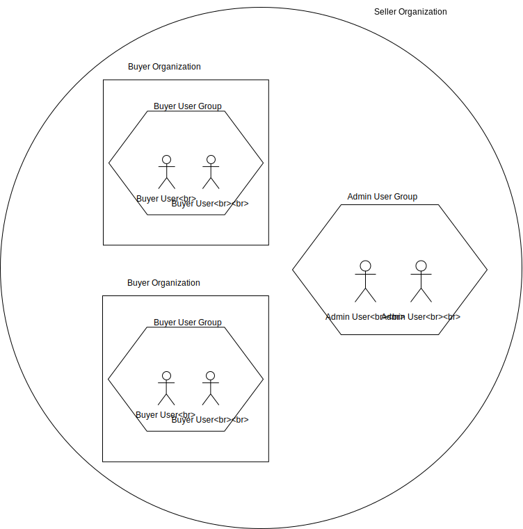

OrderCloud provides rich support for modeling a typical B2B organization. Within this organization there is an inherent hierarchy that is necessary to understand.

The following diagram depicts the B2B organization structure as represented by Ordercloud:

## Sellers and Buyers

At the highest level is the seller organization. Ultimately a seller organization exists to own and manage the buyer organizations within it. The administrators who maintain the buyers's functions (for example customer service representatives or catalog/product managers) are termed seller users and belong directly to the seller organization.

Buyer organizations live within a seller organization and also have their own set of users, these buyer users' main function is to purchase products.

## User Groups

At both the seller and buyer level there exists usergroups that can be used to group together users with common traits. This makes the management of such users much easier, as we'll see in the following sections.
